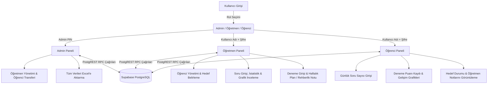
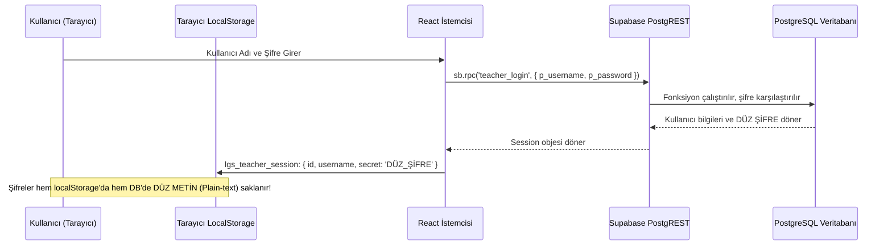

# LGS Soru Takip Sistemi — Sistem Mimarisi, Çalışma Mantığı ve Güvenlik Analiz Raporu

Bu doküman; **LGS Soru Takip** projesinin çalışma mantığını, kullanıcı ve veri akışlarını, kimlik doğrulama mekanizmasını, şifre ve veri saklama yöntemlerini, altyapı bileşenlerini ve tespit edilen güvenlik açıklarını detaylı bir şekilde açıklamak üzere hazırlanmıştır.

---

## İçindekiler
1. [Projenin Genel Tanımı ve Amacı](#1-projenin-genel-tanımı-ve-amacı)
2. [Altyapı ve Teknoloji Yığını (Tech Stack)](#2-altyapı-ve-teknoloji-yığını-tech-stack)
3. [Sistem Mimarisi ve Çalışma Mantığı](#3-sistem-mimarisi-ve-çalışma-mantığı)
   - [3.1. Rol Tabanlı Erişim Modeli](#31-rol-tabanlı-erişim-modeli)
   - [3.2. Admin (Yönetici) Modülü](#32-admin-yönetici-modülü)
   - [3.3. Öğretmen Modülü](#33-öğretmen-modülü)
   - [3.4. Öğrenci Modülü](#34-öğrenci-modülü)
   - [3.5. Excel Raporlama ve Dışa Aktarım](#35-excel-raporlama-ve-dışa-aktarım)
4. [Kullanıcılar ve Şifreler Nereye, Nasıl Kaydediliyor?](#4-kullanıcılar-ve-şifreler-nereye-nasıl-kaydediliyor)
   - [4.1. İstemci Tarafı (Tarayıcı / LocalStorage)](#41-istemci-tarafı-tarayıcı--localstorage)
   - [4.2. Veritabanı Tarafı (Supabase / PostgreSQL)](#42-veritabanı-tarafı-supabase--postgresql)
5. [Güvenlik Açıkları ve Risk Analizi](#5-güvenlik-açıkları-ve-risk-analizi)
   - [5.1. Kritik Düzey Zafiyetler](#51-kritik-düzey-zafiyetler)
   - [5.2. Orta ve Düşük Düzey Riskler](#52-orta-ve-düşük-düzey-riskler)
6. [Güvenlik İyileştirme ve Mimari Öneriler](#6-güvenlik-iyileştirme-ve-mimari-öneriler)
7. [Özet ve Sonuç](#7-özet-ve-sonuç)

---

## 1. Projenin Genel Tanımı ve Amacı

**LGS Soru Takip Sistemi**, Liselere Geçiş Sistemi (LGS) sınavına hazırlanan öğrencilerin günlük ders bazlı soru çözümlerini, deneme sınavı sonuçlarını ve hedeflerini takip etmelerini sağlayan, öğretmenlerin öğrencilerini denetleyip rehberlik edebildiği ve yöneticilerin (admin) tüm süreci idare edebildiği modern bir Tek Sayfa Uygulamasıdır (SPA - Single Page Application).

Sistem; defter/not defteri dokusunu andıran özel bir tipografik ve görsel tasarım diliyle hazırlanmıştır.



---

## 2. Altyapı ve Teknoloji Yığını (Tech Stack)

Proje modern web teknolojileri ve BaaS (Backend-as-a-Service) mimarisi üzerine kurulmuştur:

### 2.1. İstemci (Frontend)
- **Kütüphane / Framework**: [React 18](https://react.dev/) (`18.3.1`)
- **Programlama Dili**: [TypeScript](https://www.typescriptlang.org/) (`~5.7.2`)
- **Derleme / Paketleyici**: [Vite](https://vitejs.dev/) (`6.1.0`)
- **Stil ve Tasarım**: [Tailwind CSS](https://tailwindcss.com/) (`3.4.17`), PostCSS (`8.5.2`), Autoprefixer
- **Tipografi**: Fraunces (serif başlıklar), Inter (gövde metni), IBM Plex Mono (rakamsal ve kod verileri)
- **İkon Seti**: [Lucide React](https://lucide.dev/) (`0.475.0`)
- **Veri Görselleştirme / Grafikler**: [Chart.js](https://www.chartjs.org/) (`4.4.8`) ve [react-chartjs-2](https://react-chartjs-2.js.org/) (`5.3.0`)
- **Excel Dışa Aktarma**: [ExcelJS](https://github.com/exceljs/exceljs) (`4.4.0`) ve [SheetJS (xlsx)](https://cdn.sheetjs.com/) (`0.20.3`)

### 2.2. Sunucu & Veritabanı (Backend)
- **Hizmet Sağlayıcı**: [Supabase](https://supabase.com/) (BaaS - AWS altyapısında barındırılan PostgreSQL)
- **Veritabanı Motoru**: PostgreSQL 17
- **İstemci Kütüphanesi**: `@supabase/supabase-js` (`^2.49.1`)
- **İletişim Protokolü**: REST (PostgREST API) üzerinden PostgreSQL Fonksiyonları (RPC - Remote Procedure Call)
- **Oturum / State Yönetimi**: React State + Tarayıcı `localStorage`

---

## 3. Sistem Mimarisi ve Çalışma Mantığı

Sistemde sayfa yenilenmeden tek bir ekran üzerinden dinamik bileşen render'ı yapılmaktadır (`App.tsx`).

### 3.1. Rol Tabanlı Erişim Modeli
Uygulama açıldığında kullanıcıya 3 kart seçeneği sunulur:
1. **Admin (Yönetici)**
2. **Öğretmen**
3. **Öğrenci**

Uygulama açılışında `localStorage` kontrol edilir; eğer kayıtlı bir öğretmen veya öğrenci oturumu varsa, kullanıcı oturum açma ekranını görmeden otomatik olarak paneline yönlendirilir.

---

### 3.2. Admin (Yönetici) Modülü
- **Giriş Yolu**: Gizli bir PIN kodu girilerek `admin_login` RPC fonksiyonu tetiklenir.
- **Yetenekler**:
  - **Öğretmen Yönetimi**: Yeni öğretmen ekleme (Ad Soyad, Kullanıcı Adı, Şifre tanımlama veya otomatik PIN üretme), öğretmen güncelleme, öğretmen silme.
  - **Öğretmen Şifrelerini Görme**: Admin panelinde tüm öğretmenlerin şifreleri açık şekilde listelenir.
  - **Öğretmen Aktivite Takibi (`TeacherActivityView`)**: Bir öğretmenin sisteme giriş kayıtları (login tarih/saatleri) ve ona bağlı tüm öğrencilerin soru sayıları matris şeklinde listelenir.
  - **Öğrenci Transferi**: Bir öğretmene ait öğrenciyi başka bir öğretmene devretme (`admin_transfer_student`).
  - **Toplu Rapor**: Sistemdeki bütün öğretmenleri ve öğrencileri tek bir Excel dosyasına aktarma (`exportAllStudentsByAdmin`).

---

### 3.3. Öğretmen Modülü
- **Giriş Yolu**: Kullanıcı adı ve şifre girilerek `teacher_login` RPC fonksiyonu tetiklenir.
- **Yetenekler**:
  - **Öğrenci Takibi**: Kendisine bağlı öğrencilerin listesi ve son soru giriş zamanları görüntülenir.
  - **"Bugün Girmeyenler" Uyarısı**: O gün soru kaydı yapmayan öğrenciler sayfanın en üstünde kırmızı uyarı rozetiyle listelenir.
  - **Öğrenci Ekleme / Silme**: Yeni öğrenci oluştururken ad, kullanıcı adı, şifre ve günlük soru hedefi belirlenir.
  - **Öğrenci Detayı (`StudentDetailView`)**:
    - **Soru Dağılımı**: Bugün, Bu Hafta, Geçen Hafta, Bu Ay, Geçen Ay ve Tüm Zamanlar toplam soru istatistikleri.
    - **Ders Tablosu**: Türkçe, Matematik, Fen Bilimleri, T.C. İnkılap Tarihi, Din Kültürü ve İngilizce derslerine göre haftalık ve genel toplamlar.
    - **Gelişim Grafiği**: Günlük soru çözümlerinin Chart.js ile çizilmiş çizgi grafiği.
    - **Boş Güne Soru Girişi**: Öğrencinin geçmişte girmeyi unuttuğu günlere öğretmen geriye dönük soru adedi girebilir.
    - **Haftalık Plan & Rehberlik Notu**: Öğretmen öğrenciye özel haftalık çalışma programı ve rehberlik tavsiyesi girer.
    - **Şifre ve Kullanıcı Adı Güncelleme**: Öğretmen, öğrencinin şifresini ve kullanıcı adını değiştirebilir.
    - **Excel Raporu**: Öğrencinin tüm karnesini renkli ve formatlı Excel olarak indirme (`exportStudentFullReport`).

---

### 3.4. Öğrenci Modülü
- **Giriş Yolu**: Kullanıcı adı ve şifre girilerek `student_login` RPC fonksiyonu tetiklenir.
- **Yetenekler**:
  - **Günlük Soru Girişi**: Bugün çözülen sorular 6 temel LGS dersine göre kutucuklara girilip "Kaydet" butonuna basılır (`student_save_entry`).
  - **Hedef ve Motivasyon Sistemi**:
    - Günlük soru hedefi varsa, öğrencinin hedefi kaç soru farkla aştığı veya kaç soru kaldığı anında hesaplanarak kutlanır.
    - Kaydetme işleminden sonra ekranda ünlü düşünür veya liderlerden rastgele bir motivasyon sözü gösterilir.
  - **Haftalık Soru Dağılım Grafiği**: Son 7 günün soru çözümleri çubuk grafiğinde (Bar chart) gösterilir.
  - **Deneme Sınavı Takibi**: Öğrenci girdiği deneme sınavının adını, tarihini ve puanını sisteme ekleyebilir. Deneme puanlarının gidişatı çizgi grafiğinde gösterilir.
  - **Öğretmen Mesajları**: Öğretmenin öğrenciye yazdığı "Haftaya Dair Plan ve Öneriler" ile "Rehberlik Görüş ve Öneriler" doğrudan öğrenci panelinde gösterilir.

---

### 3.5. Excel Raporlama ve Dışa Aktarım
Sistemde iki farklı Excel kütüphanesi kullanılmaktadır (`xlsx` ve `exceljs`):
1. **Yönetici Raporu (`exportAllStudentsByAdmin`)**: Üç çalışma sayfası (Öğrenciler, Günlük Sorular, Denemeler) içeren kapsamlı bir çalışma kitabı oluşturur.
2. **Öğretmen Raporu (`exportTeacherStudents`)**: Öğretmenin kendi öğrencilerini listeler.
3. **Öğretmen Aktivite Raporu (`exportTeacherActivityExcel`, `exportTeacherLoginsExcel`)**: Günlük soru matrisini ve giriş geçmişini döker.
4. **Öğrenci Karnesi (`exportStudentFullReport`)**: ExcelJS ile özel stiller, kenarlıklar, hücre dolguları ve renkli başlıklar kullanılarak resmi bir karne görünümünde çıktı üretir.

---

## 4. Kullanıcılar ve Şifreler Nereye, Nasıl Kaydediliyor?

Projedeki kullanıcı ve şifre saklama mimarisi iki ana katmandan oluşmaktadır:



### 4.1. İstemci Tarafı (Tarayıcı / LocalStorage)
Kullanıcı "Beni Hatırla" kutucuğunu işaretlediğinde:
- **Öğretmen Oturumu**: `lgs_teacher_session` anahtarı altında saklanır:
  ```json
  {
    "id": "ogretmen_uuid",
    "username": "ali_hoca",
    "secret": "123456",
    "name": "Ali Hoca"
  }
  ```
- **Öğrenci Oturumu**: `lgs_student_session` anahtarı altında saklanır:
  ```json
  {
    "id": "ogrenci_uuid",
    "secret": "1234",
    "name": "Ahmet Yılmaz"
  }
  ```
> **Önemli Tespit**: Kullanıcıların şifreleri istemci tarafında herhangi bir şifreleme, hashing ya da JWT token olmaksızın **tamamen açık metin (plain text) olarak `secret` alanında tutulmaktadır.**

---

### 4.2. Veritabanı Tarafı (Supabase / PostgreSQL)
Projede standart Supabase Auth tablosu (`auth.users`) doğrudan login akışında **kullanılmamaktadır**. Bunun yerine özel PostgreSQL Stored Procedure (RPC) fonksiyonları ve tabloları kullanılmaktadır.

1. **Şifrelerin Durumu**:
   - `AdminDashboard.tsx` dosyasında satır 407'de:
     ```tsx
     <span className="font-mono font-medium text-ink">{t.password}</span>
     ```
   - `StudentDetailView.tsx` dosyasında satır 76 ve 332'de:
     ```tsx
     const [password, setPassword] = useState(student.password || '');
     ```
   - Bu kodlardan açıkça anlaşıldığı üzere, veritabanından dönen kullanıcı nesneleri doğrudan `password` alanını içermektedir.
   - **Sonuç**: Öğretmen ve öğrenci şifreleri veritabanında tek yönlü şifreleme algoritmaları (bcrypt, argon2, pbkdf2 vb.) ile hash'lenmemiştir. **Veritabanında doğrudan okunabilir açık metin (plain-text) olarak saklanmaktadır.**
2. **Kayıt Depolama Modeli**:
   - Projenin veritabanı yapısında tablolar (veya `soru_takip` gibi JSONB doküman tablosu) kullanılmaktadır.
   - Yapılan sorgulamada tespit edilen veri formatı şöyledir:
     ```json
     {
       "id": "msvxrkzvdgu8yc",
       "name": "DORUK ÖZBEK",
       "type": "LGS",
       "username": "doruk",
       "password": "1234",
       "teacherId": "ogretmen1"
     }
     ```
   - Öğrenciler, öğretmenler, günlük girişler ve denemeler ilişkisel sütunlarda ya da JSONB ağacında açık kimlik bilgileriyle tutulmaktadır.

---

## 5. Güvenlik Açıkları ve Risk Analizi

Yapılan kod incelemesinde tespit edilen güvenlik açıkları aşağıda ciddiyet derecelerine göre sıralanmıştır:

### 5.1. Kritik Düzey Zafiyetler (Critical Risks)

| Zafiyet | CWE / OWASP Referansı | Açıklama |
|---|---|---|
| **Açık Metin Şifre Saklama (Plaintext Passwords)** | CWE-256 / CWE-312 | Şifreler hash'lenmeden hem veritabanında hem tarayıcı `localStorage`'ında saklanmaktadır. Veritabanına veya istemci cihazına erişebilen herkes şifreleri doğrudan okuyabilir. |
| **Açık Metin Şifre Transferi ve İfşası** | OWASP Top 10 A02:2021 | Admin panelinde tüm öğretmenlerin şifreleri arayüzde açıkça gösterilmektedir. Benzer şekilde öğretmen panelinde öğrenci şifreleri açıkça okunabilmektedir. API sorgusuna bakan herhangi biri tüm şifreleri görebilir. |
| **Zayıf Oturum Doğrulama (Broken Authentication)** | OWASP Top 10 A07:2021 | Sistemde endüstri standardı olan JWT (JSON Web Token), HttpOnly Cookie veya imzalı oturum anahtarları kullanılmamaktadır. Bunun yerine her istekte kullanıcının düz şifresi (`p_password`) sunucuya gönderilerek doğrulama yapılmaktadır. |
| **Kaba Kuvvet (Brute Force) Koruması Eksikliği** | CWE-307 | Admin girişi sadece 6 karakterli bir PIN ile yapılmaktadır (`admin_login`). Sunucu veya istemci tarafında herhangi bir istek sınırlaması (Rate Limiting) ve başarısız giriş sonrası kilitleme bulunmamaktadır. Otomasyonla dakikalar içinde PIN kırılabilir. |

---

### 5.2. Orta ve Düşük Düzey Riskler (Medium & Low Risks)

1. **LocalStorage ve XSS Hassasiyeti**:
   - `localStorage` içindeki veriler JavaScript tarafından doğrudan okunabilir (`localStorage.getItem(...)`). Sitede oluşabilecek en ufak bir XSS açığında saldırgan tüm kullanıcıların kullanıcı adlarını ve şifrelerini çalabilir.
2. **Çıkış İşleminde Sunucu Tarafı İptal (Revocation) Yokluğu**:
   - Kullanıcı çıkış yaptığında sadece tarayıcıdaki `localStorage` temizlenir. Sunucu tarafında oturumu düşürecek bir mekanizma olmadığı için şifre bilindiği sürece oturum sürekli geçerlidir.
3. **Kullanıcı Girdisi ve Yetki Kontrolü Riskleri**:
   - RPC fonksiyonlarının PostgreSQL içinde `SECURITY DEFINER` yetkisiyle çalışması durumunda, fonksiyon içindeki parametre kontrolleri yetersizse rol atlama (Privilege Escalation) veya başka bir öğretmenin öğrencisini manipüle etme riski doğabilir.
4. **Çift Excel Bağımlılığı ve Bundle Şişkinliği**:
   - Projede hem SheetJS (`xlsx`) harici bir CDN tarball linkinden (`https://cdn.sheetjs.com/...`) hem de `exceljs` (`^4.4.0`) npm üzerinden yüklenmiştir. İki ayrı devasa Excel motorunun bulunması hem gereksiz paket boyutu artışına yol açmakta hem de bağımlılık takibini zorlaştırmaktadır.

---

## 6. Güvenlik İyileştirme ve Mimari Öneriler

Projeyi üretim (production) standartlarına ve KVKK/GDPR uyumluluğuna getirmek için yapılması gereken temel adımlar:

### 1. Şifrelerin Hash'lenmesi (En Acil Adım)
- Şifreler veritabanına ve sistem hafızasına **asla düz metin olarak kaydedilmemelidir**.
- PostgreSQL tarafında `pgcrypto` eklentisi kullanılarak şifreler `crypt(p_password, gen_salt('bf'))` (bcrypt) ile hash'lenmelidir.
- Arayüzden şifre okuma alanları derhal kaldırılmalı; bunun yerine "Şifre Sıfırla" veya "Yeni Şifre Belirle" alanları getirilmelidir.

### 2. Standart Supabase Auth Entegrasyonu
- Düz metin şifreli RPC oturumu yerine Supabase'in yerleşik kimlik doğrulama motoruna (`supabase.auth.signInWithPassword`) geçilmelidir.
- Bu sayede:
  - Şifreler sunucu tarafında güvenle hash'lenir.
  - İstemciye JWT access token ve refresh token verilir.
  - Tarayıcıda düz şifre saklama zorunluluğu kalkar.
  - Row Level Security (RLS) politikaları `auth.uid()` üzerinden doğrudan veritabanı seviyesinde işletilir.

### 3. Rate Limiting ve PIN Güvenliği
- `admin_login` ve kullanıcı giriş fonksiyonlarına başarısız deneme limiti (örneğin 5 hatalı denemede 15 dakika engelleme) konulmalıdır.
- Admin için PIN yerine güçlü bir parola veya iki aşamalı doğrulama (2FA) tercih edilmelidir.

---

## 7. Özet ve Sonuç

| Soru | Yanıt / Durum |
|---|---|
| **Altyapıda ne kullanılıyor?** | React 18, TypeScript, Vite, Tailwind CSS, Chart.js, ExcelJS/SheetJS, Supabase (PostgreSQL 17, PostgREST, RPC). |
| **Kullanıcılar ve şifreler nereye kaydediliyor?** | İstemcide tarayıcının `localStorage`'ında; sunucuda ise Supabase PostgreSQL veritabanında saklanmaktadır. |
| **Şifreler güvenli mi?** | **Hayır.** Şifreler hash'lenmemiştir; hem veritabanında hem arayüzde hem de localStorage'da düz metin (plain text) olarak tutulmaktadır. |
| **Güvenlik açığı var mı?** | **Evet, kritik düzeyde.** Başta açık metin şifreler, admin panelinde şifrelerin listelenmesi, rate limiting olmaması ve standart JWT/Auth kullanılmaması olmak üzere ciddi güvenlik açıkları mevcuttur. |

*Bu analiz raporu, projenin mevcut kod tabanı ve mimari yapısı incelenerek eksiksiz olarak oluşturulmuştur.*
